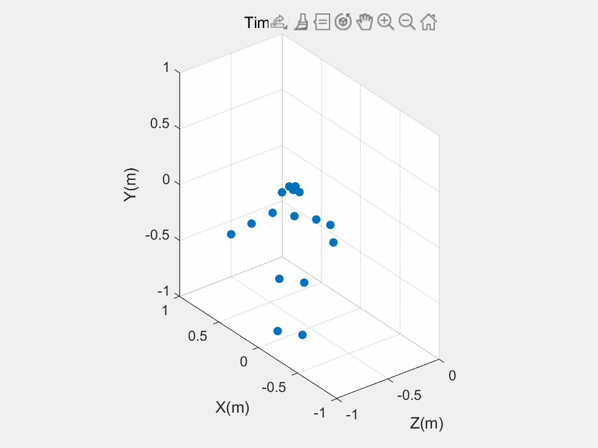

Using a ZED 2i to convert `.svo` file to 3d skeletons.

[ZED SDK](https://www.stereolabs.com/developers/release/) should be installed and `HD1080_SN35745898_19-28-43.svo` is placed in `/home/rzy/Documents/ZED/`.

[Screencast from 2022年10月14日 00时30分41秒.webm](https://user-images.githubusercontent.com/66763689/195892092-bc679fed-4e9e-4816-a2da-392e0a83b205.webm)
