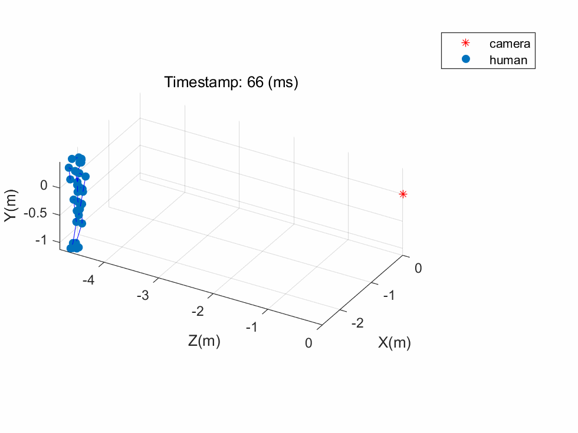
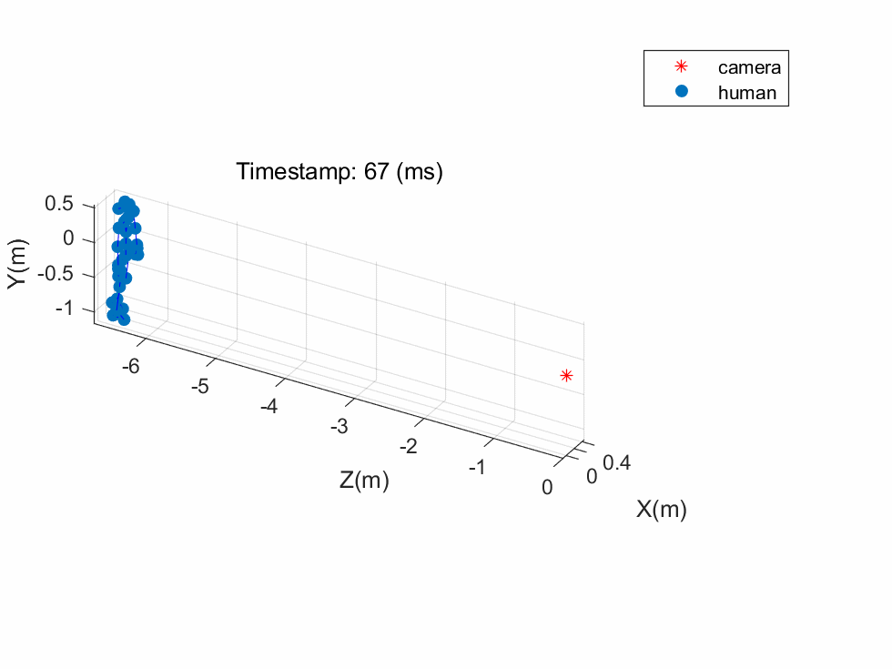
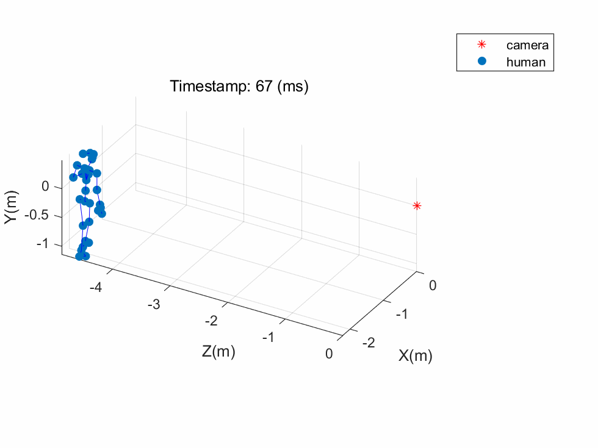
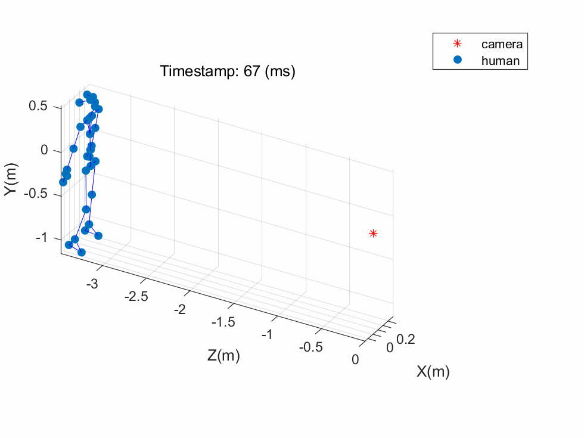

Using a ZED 2i to convert `.svo` file to 3d skeletons.

[ZED SDK](https://www.stereolabs.com/developers/release/) should be installed and `HD1080_SN35745898_19-28-43.svo` is placed in `/home/rzy/Documents/ZED/`.

## test 1

+ walk1:

  

+ walk2:

  

+ run1:

  

+ run2:

  

+ squat:

  

## test2

